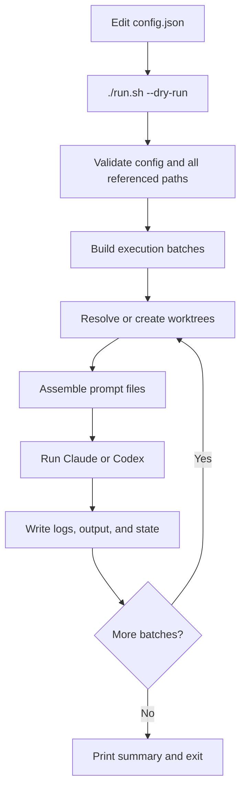

# Waverunner

Waverunner lets you hand one project a list of AI tasks, then automatically spin them out into isolated git worktrees, run them in parallel or sequence, and keep the prompts, logs, outputs, and state organized for review. If you already use AI coding agents but do not want every core repo reinventing its own one-off orchestration scripts, Waverunner extracts that infrastructure into a reusable runner so your product repos stay focused on product work instead of worktree plumbing.

Unlike worktree managers that focus on interactive session control, Waverunner is a lightweight, config-driven execution unit: define the wave once, reuse it across projects, reduce redundant setup, and stop rebuilding the same custom runner logic inside repos where it is not part of the actual product.

Waverunner is Ralph-adjacent, not a Ralph implementation. Ralph Wiggum is an iterative fresh-context loop that keeps rerunning an agent until the work is done; Waverunner is a declarative wave runner that executes a planned batch of isolated tasks across git worktrees.

## Quick Workflow

The intended operator flow is:

1. Run `./install.sh`
2. Go back to the core project root
3. Paste the generated prompt to your AI coding agent so it can fill `config.json` and create any missing prompt artifacts

Suggested prompt:

```text
Refer to <relative-path-to-waverunner>/howtouse.md and set up Waverunner for this project. Update <relative-path-to-waverunner>/config.json to match the tasks I give you, create any missing master-prompt, techspec, and prompt artifacts the wave needs, keep the orchestration inside Waverunner instead of adding custom runner scripts to the core repo, and then show me the resulting wave plan with any assumptions.
```

`install.sh` prints the same prompt at the end of installation with the resolved path to `howtouse.md`, so the installer human can copy and paste it directly.

## Why Use It

- Run multiple Claude or Codex tasks from one config file.
- Isolate every execution in its own git worktree.
- Mix parallel batches with explicit sequential barriers.
- Keep an audit trail of assembled prompts, logs, outputs, and worktree state.
- Install a self-contained runner into a project without tying day-to-day use to this source repo.

## What It Installs

Run `install.sh` from this repo once, then operate from the installed target directory.

```text
<target>/
├── run.sh
├── config.json
├── howtouse.md
├── adapters/
│   └── <cli>.sh
├── output/        # auto-created on first real run
├── logs/          # auto-created on first real run
└── state.json     # auto-created on first real run
```

Waverunner installs one shared runner plus the selected CLI adapter. It copies a `howtouse.md` guide for humans or AI agents, but it does not create or manage `specs/`, `prompts/`, or `master_prompt.md`. Your prompt and techspec files stay fully user-owned and can live anywhere in the project.

## Requirements

- Bash 3.2+
- `jq`
- `git`
- One supported AI CLI installed and already authenticated:
  - `claude`
  - `codex`

If `jq` or `git` is missing, both `install.sh` and `run.sh` exit with code `2` and print a one-line install hint.

## Install

From the source repo:

```bash
./install.sh
```

The installer prompts for:

1. Project root path
2. Install target path
3. Whether to append the install dir to `<project_root>/.gitignore`
4. CLI choice: `claude` or `codex`
5. Git dir, or blank to reuse project root

Behavior to know:

- The installer keeps asking until the project root exists.
- The install target defaults to `<project_root>/waverunner`.
- If the install target already exists, the installer can remove it or let you choose another path.
- If the install target lives under the project root, the installer can append `/<relative-target>/` to the project `.gitignore` without duplicating the entry.
- The generated `config.json` contains one baked-in example execution.
- The installer copies `howtouse.md` and prints a ready-to-paste prompt that points your project AI agent at it.

Upgrade an existing installed runner:

```bash
./install.sh --upgrade /path/to/installed/waverunner
```

Current upgrade behavior overwrites `run.sh`, `howtouse.md`, and the selected adapter file.

## Configure

`run.sh` always reads `config.json` from its own directory. All relative paths inside `config.json` are resolved from that installed directory.

You do not need to fill in the JSON by hand. In practice, many teams ask their AI coding agent to generate or update `config.json` for the wave they want to run.

Example:

```json
{
  "cli": "claude",
  "project_root": "/var/www/my_project",
  "git_dir": "/var/www/my_project",
  "master_prompt_path": "/var/www/my_project/master_prompt.md",
  "output_base": "./output",
  "max_parallel": 3,
  "executions": [
    {
      "techspec_path": "/var/www/my_project/specs/SPEC-01.md",
      "prompt_path": "/var/www/my_project/prompts/SPEC-01.md",
      "parallel": "yes",
      "model": "claude-sonnet-4-6",
      "effort": "high"
    },
    {
      "techspec_path": "/var/www/my_project/specs/SPEC-02.md",
      "prompt": "Focus on failure cases first.",
      "parallel": "yes",
      "model": "claude-sonnet-4-6",
      "effort": "high"
    },
    { "parallel": "no" },
    {
      "techspec_path": "/var/www/my_project/specs/SPEC-03.md",
      "prompt_path": "/var/www/my_project/prompts/SPEC-03.md",
      "parallel": "no",
      "model": "claude-sonnet-4-6",
      "effort": "high"
    }
  ]
}
```

Top-level fields:

- `cli`: `claude` or `codex`
- `project_root`: validated sanity reference for the target project
- `git_dir`: repo root used for `git worktree`
- `master_prompt_path`: project-wide prompt file
- `output_base`: base directory for per-execution outputs
- `max_parallel`: maximum allowed size of one parallel batch; defaults to `3`
- `executions`: ordered execution list

Per-execution fields:

- `techspec_path`: required for non-barrier entries
- `prompt` or `prompt_path`: at least one required
- `parallel`: required, `yes` or `no`
- `model`: required
- `effort`: required for `claude`, ignored for `codex`

Barrier entry:

```json
{ "parallel": "no" }
```

That entry runs nothing. It only flushes the current parallel batch.

## Run

Inspect the resolved plan first:

```bash
./run.sh --dry-run
```

Validate the config and inspect current tracked execution state without launching anything:

```bash
./run.sh --check
```

Resume a partially completed wave and skip executions already marked `done` for the same inputs:

```bash
./run.sh --resume
```

Launch the wave:

```bash
./run.sh
```

Before any execution starts, `run.sh` validates:

- `config.json` exists and is valid JSON
- required top-level fields are present
- the selected AI CLI is installed
- `project_root`, `git_dir`, and `master_prompt_path` resolve correctly
- every referenced `techspec_path` and `prompt_path` exists
- `output_base` can be created or written
- no batch contains more than `max_parallel` consecutive `parallel: "yes"` entries

Dry-run output shows the batch plan, including:

- resolved `exec_id`
- model
- effort for `claude`
- prompt source type
- absolute techspec path
- planned worktree path
- resolved output directory

`--check` reports:

- whether the config validates successfully
- the planned batches
- the last known tracked status for each configured execution
- last failure class and exit code, if any
- tracked worktree path and whether that worktree is clean, dirty, missing, or untracked
- resume status and whether the stored resume fingerprint matches the current inputs

Real execution:

- prints the wave start, log directory, output directory, and batch/task launch progress to stdout
- creates `logs/<wave_ts>/`
- creates `output/<wave_ts>/<exec_id>/`
- creates or reuses git worktrees under `<git_dir>/.worktrees/`
- refuses to reuse a tracked worktree if it is dirty
- acquires a run lock so only one real wave runs from an install directory at a time
- runs the selected CLI in the adapter-defined unattended mode
  - `claude`: `-p --allowedTools ... --max-turns 100 --output-format json --dangerously-skip-permissions`
  - `codex`: `exec -a never -s workspace-write`
- updates `state.json`
- prints `DONE` or `FAILED (<failure_class>)` per execution when a task fails
- records `skipped` in `state.json` for executions not launched because fail-fast stopped later batches
- supports `--resume`, which skips executions already marked `done` when the current CLI/model/prompt/spec inputs still match the recorded resume fingerprint
- exits `1` if any execution failed

## Execution Flow



Batching rules:

- Consecutive `parallel: "yes"` entries run together in one batch.
- A batch may contain at most `max_parallel` parallel executions.
- `parallel: "no"` runs alone.
- `{ "parallel": "no" }` acts as a barrier between parallel waves, and you must insert those breaks manually when you want more tasks than `max_parallel` allows in a single batch.
- If an execution fails inside a running parallel batch, the rest of that batch is allowed to finish.
- Once a batch has any failure, Waverunner stops before launching later batches.
- In `--resume` mode, executions already completed with matching inputs are skipped and the remaining work continues from the first incomplete batch.
- Final process exit code is `1` if any execution failed.

## Prompt and Output Model

For each execution, Waverunner writes:

- `logs/<wave_ts>/<exec_id>.prompt.md`
- `logs/<wave_ts>/<exec_id>.log`
- `output/<wave_ts>/<exec_id>/`

Prompt shape:

```markdown
<contents of master_prompt_path>

---

<inline prompt, if present>

<prompt_path contents, if present>

---

## Techspec
Read your techspec at: <absolute techspec path>

## Output directory
Write all deliverables to: <absolute output path>/
```

The techspec is referenced by absolute path, not inlined into the prompt.

Claude logs are captured as JSON output and treated as failed when Claude reports `is_error=true`, even if the process itself exits successfully.

## Worktree Model

Each non-empty execution gets an `exec_id` in this form:

```text
<NN>_<sanitized_techspec_basename>
```

Example:

```text
01_SPEC-03_autocorr
```

If multiple executions would otherwise produce the same `exec_id`, Waverunner adds a deterministic numeric suffix such as `01_SPEC-03_autocorr_2`.

For each execution, `run.sh` either:

- reuses a tracked worktree from `state.json` if it still exists, or
- creates a new worktree at `<git_dir>/.worktrees/<exec_id>`

The branch name matches the worktree name. Reused tracked worktrees must be clean before Waverunner will run the task again. If a matching path already exists outside tracked state, Waverunner appends a timestamp suffix and retries.

Resume matching is based on a stored fingerprint of the current execution inputs: CLI, model, effort, master prompt content, techspec content, and prompt content. If any of those change, `--resume` reruns that execution instead of skipping it.

## Who This Is For

- Teams or solo operators running repeatable spec-driven AI tasks against one repo
- People who want cheap orchestration without building a queueing system
- Workflows where prompt auditability and worktree isolation matter
- Projects that already organize work around techspecs, task prompts, and output directories

## When Not To Use It

- You need DAG scheduling, retries, budgets, or centralized coordination
- You want a live UI, dashboards, or multi-user job control
- You only run one-off interactive AI CLI sessions
- You do not want persistent worktrees to accumulate over time

## Current Limitations

- No retries
- No DAG scheduling
- No automatic worktree cleanup
- No live viewer for parallel runs
- No CLI version detection

For day-to-day operating guidance, see [RUNBOOK.md](./RUNBOOK.md).
